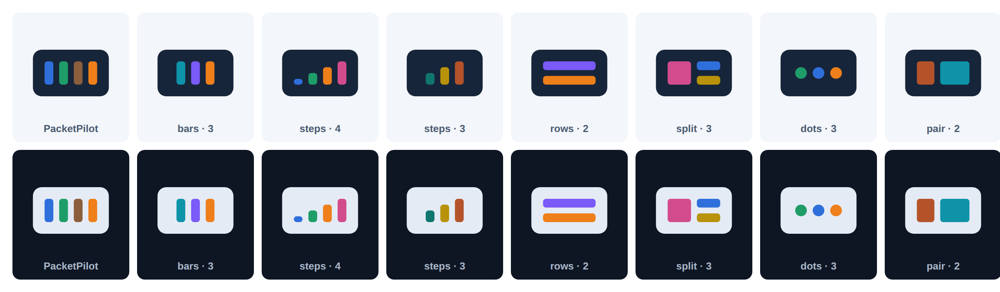

<!-- The logo style of every project of the family. -->
# 2. Logo

## 2.1 The idea

The logo is **a dark, rounded card holding a few colored parts**. The card is a device, a
frame, a container: the "thing" the app works with. The parts are the app's core idea,
abstracted to two to four flat pieces in signal colors. PacketPilot's card holds four
vertical bars: the layers of a packet in the colors of the cable pairs.



## 2.2 Geometry (fixed)

```
32 × 32 units
┌────────────────────────────────┐
│                                │  y 0..8   empty (belongs to the logo)
│   ╭────────────────────────╮   │  card: x 3, y 8, 26 × 16, rx 3, fill --ink
│   │   ┌────────────────┐   │   │
│   │   │  content box   │   │   │  content box: x 7..25, y 12..20 (18 × 8)
│   │   └────────────────┘   │   │  4 units from every card edge
│   ╰────────────────────────╯   │
│                                │  y 24..32 empty
└────────────────────────────────┘
```

- Card: `<rect x="3" y="8" width="26" height="16" rx="3" fill="var(--ink)"/>`. In files with
  fixed colors: `#17253A` (light) or `#E4EBF5` (dark).
- Content parts: flat fills, rectangles with `rx="1"` or circles. No strokes, no gradients, no
  shadows, no text, no letters, no outlines.
- Content colors: 1 to 4 **different** signal colors, the same in light and dark mode. Never
  ink, grey, white or black inside the card.

## 2.3 Patterns (choose one)

| Pattern | Parts | Geometry | Use it for |
|---|---|---|---|
| `bars` | 1–4 | vertical bars 3 × 8, gap 2, centered | layers, sequences, steps of a process (PacketPilot: 4) |
| `steps` | 2–4 | bars 3 wide, heights rising by 2 to 8, bottom-aligned, gap 2 | growth, levels, statistics, progress, scores |
| `rows` | 2 | two rows 18 × 3, gap 2 | lists, text, documents, records, notes |
| `split` | 3 | a square 8 × 8 and two rows 8 × 3 beside it, gap 2 | media with text, cards, catalogs, profiles |
| `dots` | 2–3 | circles of diameter 4 on the middle line, gap 2 | messages, people, events, signals |
| `pair` | 2 | a block 6 × 8 and a block 10 × 8, gap 2 | key and value, settings, forms, comparisons |

Don't invent other patterns. If none fits, take `bars`: it is the family's signature.

## 2.4 Making the files

The logo of a project is **made from `project.conf`**, never drawn by hand:

```
LOGO_PATTERN="bars"
LOGO_COLORS="blue,green,brown,orange"
```

- `bash build.sh` writes `assets/logo/<id>-icon-light.svg` and `-dark.svg`, the favicon and the
  rail logo in `src/index.html` (managed blocks). `blueprint check` fails if any of them differs.
- `node .blueprint/tools/blueprint.mjs logo` writes the PNGs: `<id>-icon-{light,dark}.png`,
  `<id>-icon-{light,dark}-background.png` (1024 × 1024, transparent or on `#FFFFFF` /
  `#0E1624`) and `<id>-apple-touch-icon.png` (180 × 180). `blueprint new` does it right away.
- `.blueprint/tools/make-logo.mjs` draws them; [logo/logo-template.svg](logo/logo-template.svg)
  shows the frame. With `bars` and `blue,green,brown,orange` it reproduces PacketPilot's icon
  exactly.

Choosing: the pattern from the table above by what the app is about, the colors from the
signal colors that the app gives a meaning (section 3.3 of 01-design.md), so that
the logo and the app tell the same story.

## 2.5 Where the logo appears

- **Rail:** first element (managed block `logo` in `src/index.html`), 36 × 36 px, inline SVG with `fill="var(--ink)"` for the card and
  `var(--c-…)` for the parts, so it follows the theme. Hidden on phones (the bottom bar has no
  logo).
- **Favicon:** the light SVG as a data URI in `<link rel="icon">`.
- **Marketing and documentation:** the PNGs. The logo has **no wordmark**: the app name is set
  next to it only where text is needed anyway (the hero `h1`, a README title). PacketPilot's
  older wordmark PNGs (`assets/logo/packetpilot-logo-*.png`) are the only exception and are not
  repeated in new projects.
- Never place the logo inside the page content, never scale it above the rail size in the app,
  and never recolor the card.

---
